# source code
## **Alphuzz**
----------------------
### **1. installation**
X86 Linux:

```bash
$ git clone https://github.com/artifact11/Alphuzz.git
```
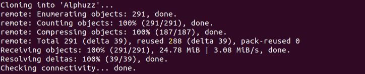

```bash
$ cd Alphuzz 
$ make
```
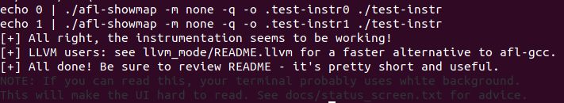

You can choose to install Alphuzz or not.
```bash
$ sudo make install
```
i386 Linux:

```bash
$ cd Alphuzz 
$ AFL_NO_X86=1 make
```

### **2. Instrumenting programs for use with Alphuzz**
If you're having a hard time reading such a large section of text, please refer to the examples provided.

When source code is available, instrumentation can be injected by a companion tool that works as a drop-in replacement for gcc or clang in any standard build process for third-party code.

The instrumentation has a fairly modest performance impact; in conjunction with other optimizations implemented by afl-fuzz, most programs can be fuzzed as fast or even faster than possible with traditional tools.

The correct way to recompile the target program may vary depending on the specifics of the build process, but a nearly-universal approach would be:

```bash
$ CC=/path/to/Alphuzz/afl-gcc ./configure
$ make clean all
```

For C++ programs, you'd would also want to set CXX=/path/to/afl/afl-g++. 

The clang wrappers (afl-clang and afl-clang++) can be used in the same way; clang users may also opt to leverage a higher-performance instrumentation mode, as described in llvm_mode/README.llvm.

When testing libraries, you need to find or write a simple program that reads data from stdin or from a file and passes it to the tested library. In such a case, it is essential to link this executable against a static version of the instrumented library, or to make sure that the correct .so file is loaded at runtime (usually by setting LD_LIBRARY_PATH). The simplest option is a static build, usually possible via:

```bash
$ CC=/path/to/Alphuzz/afl-gcc ./configure --disable-shared
```

Setting ```AFL_HARDEN=1``` when calling ```make``` will cause the CC wrapper to automatically enable code hardening options that make it easier to detect simple memory bugs. Libdislocator, a helper library included with AFL (see libdislocator/README.dislocator) can help uncover heap corruption issues, too.


PS. ASAN users are advised to review notes_for_asan.txt file for important caveats.

#### **Example**
Here, we use the source code of readelf to demonstrate how to perform instrumentation and how to use Alphuzz to test the program.

First, download the source code and unzip the package.
```bash
$ wget https://ftp.gnu.org/gnu/binutils/binutils-2.39.tar.gz
$ tar xf binutils-2.39.tar.gz
$ apt install texinfo
```
Then use afl-gcc and afl-g++ to compile the program.
```bash
$ cd binutils-2.39
$ CC=~/path/to/Alphuzz/afl-gcc CXX=~/.../afl-g++ ./configure 
$ make
```
If you have output similar to the following image, you are compiling the program with afl-gcc.
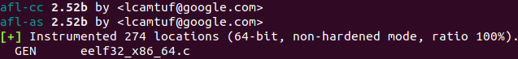


Now, the instrumentation is complete. We can use Alphuzz to test the program. The fuzzing process itself is carried out by the afl-fuzz utility.
Sometimes, afl-fuzz requires some permissions to run.
```bash
$ echo core >/proc/sys/kernel/core_pattern
$ cd /sys/devices/system/cpu
$ echo performance | tee cpu*/cpufreq/scaling_governor
```
Then, use the following command to test the program.
```bash
$ mkdir in
$ cp /usr/bin/objdump ./in
$ ./Alphuzz/afl-fuzz -i ./in -o ./out -- ./binutils-2.39/binutils/readelf -d @@
```
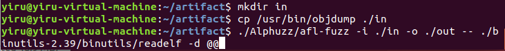


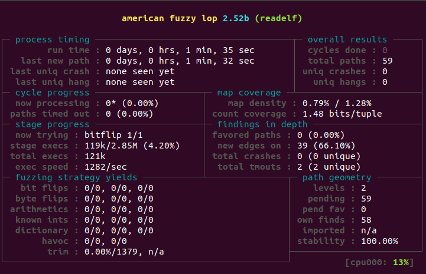


### **3. Instrumenting binary-only apps**

When source code is *NOT* available, the fuzzer offers experimental support for fast, on-the-fly instrumentation of black-box binaries. This is accomplished with a version of QEMU running in the lesser-known "user space emulation" mode.

QEMU is a project separate from AFL, but you can conveniently build the feature by doing:

```bash
$ cd qemu_mode
$ sudo apt install libtool libtool-bin libglib2.0-dev zlib1g automake bison
$ ./build_qemu_support.sh
$ cd ../
$ make
```

For additional instructions and caveats, see qemu_mode/README.qemu.

The mode is approximately 2-5x slower than compile-time instrumentation, is less conductive to parallelization, and may have some other quirks.

#### **Example**

Here, we use objdump to demenstrate how to test binaries in qemu_mode.
```bash
$ which objdump
$ ./Alphuzz/afl-fuzz -i ./Alphuzz/testcases/others/elf/ -o ./out -Q -- /usr/bin/objdump -d @@
```
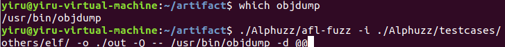

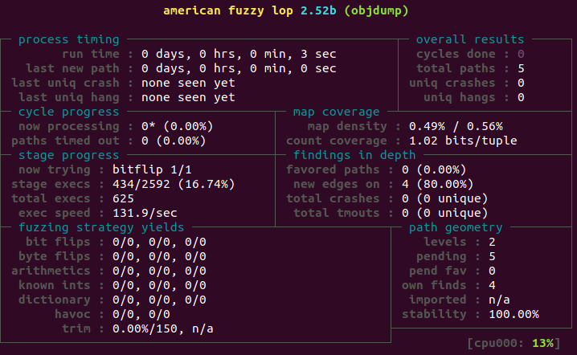

### **4. Fuzzing binaries**

The fuzzing process itself is carried out by the afl-fuzz utility. This program requires a read-only directory with initial test cases, a separate place to store its findings, plus a path to the binary to test.

For target binaries that accept input directly from stdin, the usual syntax is:

```bash
$ ./afl-fuzz -i testcase_dir -o findings_dir /path/to/program [...params...]
```

For programs that take input from a file, use '@@' to mark the location in the target's command line where the input file name should be placed. The fuzzer will substitute this for you:

```bash
$ ./afl-fuzz -i testcase_dir -o findings_dir /path/to/program @@
```

You can also use the -f option to have the mutated data written to a specific file. This is useful if the program expects a particular file extension or so.

Non-instrumented binaries can be fuzzed in the QEMU mode (add ```-Q``` in the command line) or in a traditional, blind-fuzzer mode (specify ```-n```).

You can use ```-t``` and ```-m``` to override the default timeout and memory limit for the executed process; rare examples of targets that may need these settings touched include compilers and video decoders.


Note that afl-fuzz starts by performing an array of deterministic fuzzing steps, which can take several days, but tend to produce neat test cases. If you want quick & dirty results right away - akin to zzuf and other traditional fuzzers - add the ```-d``` option to the command line.

### **5. Interpreting output**

See the status_screen.txt file for information on how to interpret the
displayed stats and monitor the health of the process. Be sure to consult this
file especially if any UI elements are highlighted in red.

The fuzzing process will continue until you press Ctrl-C. At minimum, you want
to allow the fuzzer to complete one queue cycle, which may take anywhere from a
couple of hours to a week or so.

There are three subdirectories created within the output directory and updated
in real time:

- queue/   
  - test cases for every distinctive execution path, plus all the starting files given by the user.

- crashes/ 
  - unique test cases that cause the tested program to receive a fatal signal (e.g., SIGSEGV, SIGILL, SIGABRT). The entries are grouped by the received signal.

- hangs/   
  - unique test cases that cause the tested program to time out. The default time limit before something is classified as a hang is the larger of 1 second and the value of the -t parameter. The value can be fine-tuned by setting AFL_HANG_TMOUT, but this is rarely necessary.

Crashes and hangs are considered "unique" if the associated execution paths involve any state transitions not seen in previously-recorded faults. If a single bug can be reached in multiple ways, there will be some count inflation early in the process, but this should quickly taper off.

The file names for crashes and hangs are correlated with parent, non-faulting queue entries. This should help with debugging.

When you can't reproduce a crash found by afl-fuzz, the most likely cause is that you are not setting the same memory limit as used by the tool. Try:

```bash
$ LIMIT_MB=50
$ ( ulimit -Sv $[LIMIT_MB << 10]; /path/to/tested_binary ... )
```

Change LIMIT_MB to match the -m parameter passed to afl-fuzz. On OpenBSD, also change -Sv to -Sd.

Any existing output directory can be also used to resume aborted jobs; try:

```bash
$ ./afl-fuzz -i- -o existing_output_dir [...etc...]
```
----------------------
## **Alphuzzplusplus**
----------------------
### **1. installation**
```bash
$ git clone https://github.com/artifact11/Alphuzzplusplus.git
```
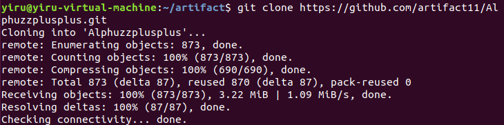

Alphuzzplusplus is implemented on top of AFLplusplus. AFLplusplus is a superior fork to AFL - more speed, more and better mutations, more and better instrumentation, custom module support, etc. Therefore, the installation of Alphuzzplusplus is much more complicated than the installation of Alphuzz. Here, we only use qemu_mode. For the details of other modes, please refer to Alphuzzplusplus/README_ori_aflplusplus.md.

```bash
$ sudo apt-get update
$ sudo apt-get install -y build-essential python3-dev automake git flex bison libglib2.0-dev libpixman-1-dev python3-setuptools
# try to install llvm 11 and install the distro default if that fails
$ sudo apt-get install -y lld-11 llvm-11 llvm-11-dev clang-11 || sudo apt-get install -y llvm llvm-dev clang 
$ sudo apt-get install -y gcc-$(gcc --version|head -n1|sed 's/.* //'|sed 's/\..*//')-plugin-dev libstdc++-$(gcc --version|head -n1|sed 's/.* //'|sed 's/\..*//')-dev
$ cd Alphuzzplusplus
$ make binary-only
```

Dependencies:

- Python >= 3.6
- Ninja >= 1.7


### **2. Fuzzing binaries**
Please refer to the usage of Alphuzz.


# **Docker image**

We poublish a docker image on docker hub. The size of this image is about 14.7GB.

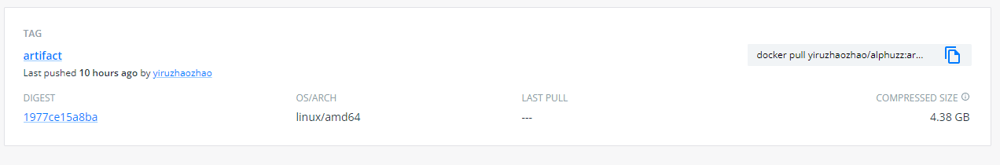


```bash
$ sudo docker pull yiruzhaozhao/alphuzz:artifact

$ sudo docker run --privileged -it yiruzhaozhao/alphuzz:artifact /bin/bash
```

We put the datasets binaries and initial seeds under the root directory.

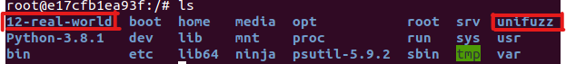


We put the datasets binaries and initial seeds under the */home* directory.

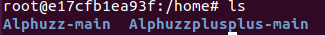


## **Example**
Take Unifuzz dataset for example.

### **Alphuzz**

```bash
$ /home/Alphuzz-main/afl-fuzz -i /unifuzz/seeds/exiv2 -o /home/out -Q -- /unifuzz/binaries/exiv2 @@ 
```
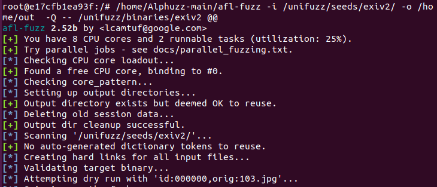
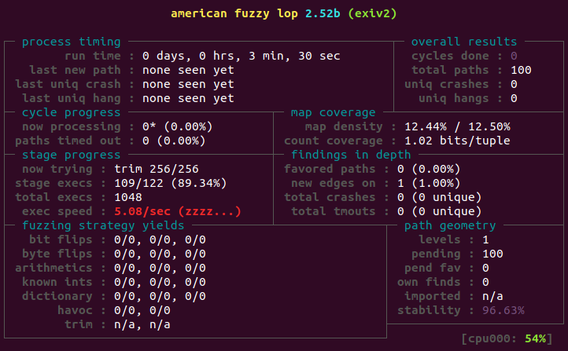


### **Alphuzzplusplus**
```bash
$ /home/Alphuzzplusplus-main/afl-fuzz -i /unifuzz/seeds/cflow -o /home/out -Q -t 3000+ -- /unifuzz/binaries/cflow @@ 
```

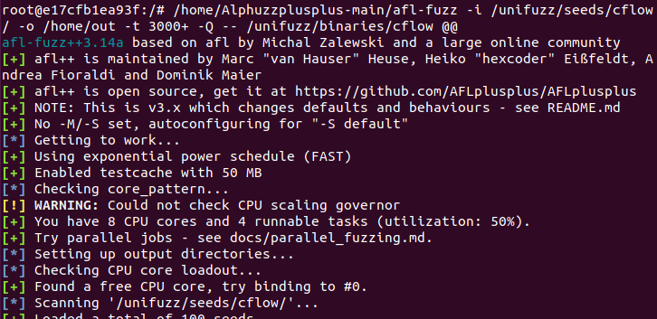
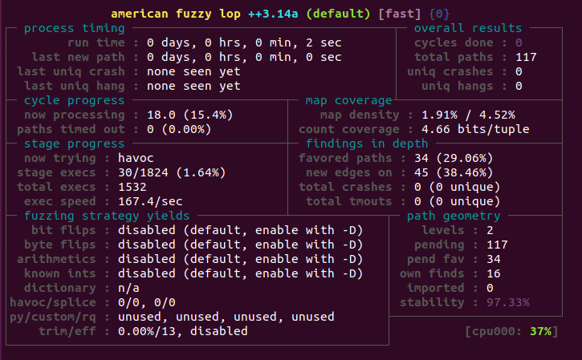